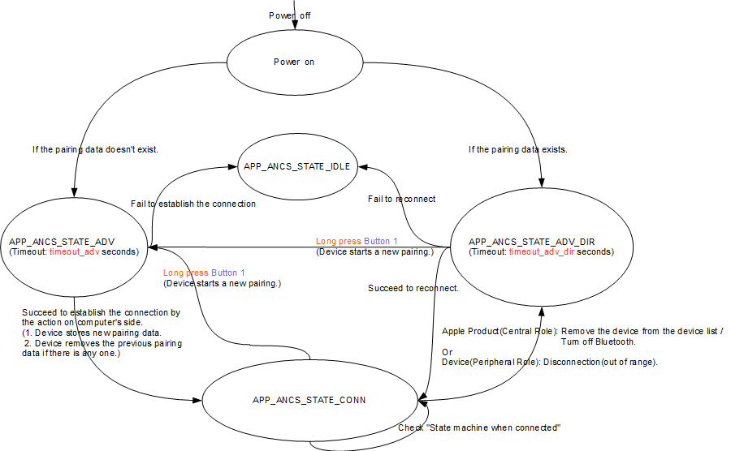
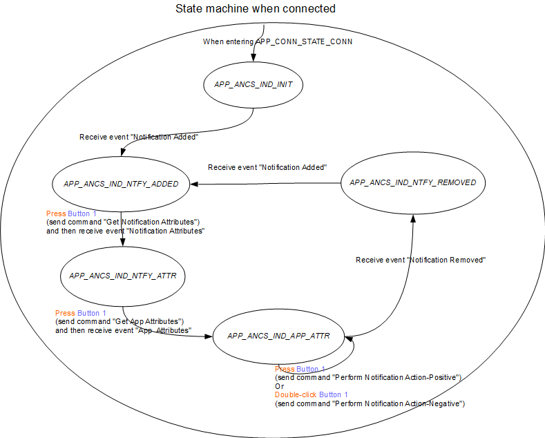
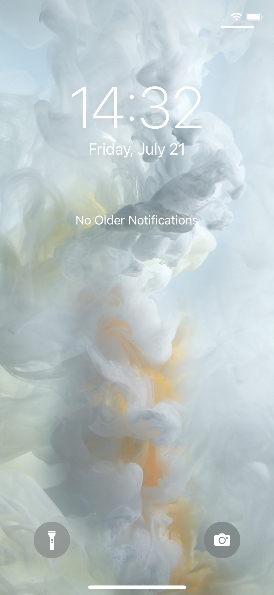
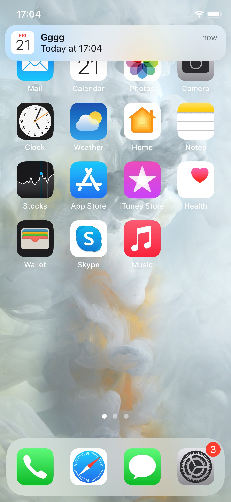

# ANCS Principal Application

## Table of Contents
- 1.Introduction
- 2.Contents
  - 2.1 Working Flow
  - 2.2 Testing
    - 2.2.1 Environment Setup
    - 2.2.2 Test Introduction
    - 2.2.3 Test Cases

## 1. Introduction
 This application which implements ANCS(The Apple Notification Center Service) profile, works as a peripheral role. There are two parts in this document. The first part is **2.1 Working Flow** which describes how this application works. Second part is **2.2 Testing** which introduces the test environment and three test cases. The curiosity board in this document refers to WBZ series curiosity board like WBZ351 curiosity board,… .
 The Button 1 in this document refers to SW2 on the curiosity board.

## 2. Contents
### 2.1 Working Flow
State machine:

State machine when connected:

| Description                        | Variable        | Value      |
| ---------------------------------- | --------------- | ---------- |
|The timeout of advertising          | timeout_adv     | 60 seconds |
|The timeout of directed advertising | timeout_adv_dir | 30 seconds |

This application demonstrates how to simulate an ANCS device on the curiosity board which is **Device** in the state machine. There are the following states and their introductions behind in state machines:

State machine:
- **APP_ANCS_STATE_IDLE**: This application stays in the idle mode.
- **APP_ANCS_STATE_ADV**: The application is waiting for pairing for timeout_adv seconds.
- **APP_ANCS_STATE_ADV_DIR**: The application is waiting for reconnection for timeout_adv_dir seconds.
- **APP_ANCS_STATE_CONN**: The application is ready for sending commands/receiving notifications.

State machine when connected:
- **APP_ANCS_IND_INIT**: The application enters this state when connected.
- **APP_ANCS_IND_NTFY_ADDED**: The application received the event "Notification Added" and is waiting for a button-pressing to send the command "Get Notification Attributes".
- **APP_ANCS_IND_NTFY_ATTR**: The application received the data related to "Notification Attributes" and is waiting for a button-pressing to send the command "Get App Attributes".
- **APP_ANCS_IND_APP_ATTR**: The application received the data related to "App Attributes" and is waiting for a button action to send the command "Perform Notification Action-Positive"/"Perform Notification Action-Negative".
- **APP_ANCS_IND_NTFY_REMOVED**: The application received the event "Notification Removed" and is waiting for another event "Notification Added".

This application relies on Button 1 as the input and LEDs/UART as the output to have interactions with users. MPLAB® X Integrated Development Environment (IDE) provides a UART tool which is in Tools/Embedded/Simple Serial Port Terminal.
- Button 1:
  - Type of Pressing:
    - Press: Press the button for less than 500 ms.
    - Long press: Press the button for more than 500 ms.
    - Double-click: click the button twice in 500 ms.
  - Functions:

| State                         | Received Event   | Action      | Behavior    |
| :---------------------------- | :--------------- | :---------- | :---------- |
| **APP_ANCS_STATE_CONN** | -     | Long press Button 1 | Disconnect Device from Apple Product and start a new pairing |
| **APP_ANCS_STATE_ADV_DIR** | - | Long press Button 1 | Start a new pairing |
| **APP_ANCS_STATE_CONN** | "Notification Added"(**APP_ANCS_IND_NTFY_ADDED**) | Press Button 1 | Send the command "Get Notification Attributes" |
| **APP_ANCS_STATE_CONN** | "Notification Attributes"(**APP_ANCS_IND_NTFY_ATTR**) | Press Button 1 | Send the command "Get App Attributes |
| **APP_ANCS_STATE_CONN** | "App  Attributes"(**APP_ANCS_IND_APP_ATTR**) | Press Button 1 | Send the command "Perform Notification Action-Positive" |
| **APP_ANCS_STATE_CONN** | "App  Attributes"(**APP_ANCS_IND_APP_ATTR**) | Double-click Button 1 | Send the command "Perform Notification Action-Negative |

- LEDs indicate the current state according to the following table:

| APP Connection State        | LED behavior                                                           |
| --------------------------- | ---------------------------------------------------------------------- |
| APP_ANCS_STATE_IDLE         | All LEDs are off                                                       |
| APP_ANCS_STATE_ADV          | Green LED flashes one time every 3 seconds. (On: 50 ms, Off: 2950 ms)   |
| APP_ANCS_STATE_ADV_DIR      | Green LED flashes two time every 3 seconds. (On: 50 ms, Off: 50 ms)     |
| APP_ANCS_STATE_CONN         | Green LED flashes two times every 1.5 seconds. (On: 50 ms, Off: 150 ms) |

- UART Settings:
  - Baud Rate: 115200 bps
  - Data: 8-bits
  - Parity: None
  - Stop bits: 1 bit
  - Flow Control: None
  - Character encoding: UTF-8

### 2.2 Testing
#### 2.2.1 Environment Setup
- An iPhone.
- A WBZ series curiosity board, “the curiosity board” is used instead in the following section.
- A Microsoft Window 10 computer, “the computer” is used instead in the following section.

The curiosity board is connected to the computer with the USB cable.

#### 2.2.2 Test Introduction
There are three tests which are described below, please do them in order.

**Test 1**: Basically, the idea is to demonstrate:
- How to establish the connection and pair with the curiosity board.
- How to receive the notification and perform the actions after establishing the connection.
- How to reconnect to the curiosity board after disconnecting from it.

**Test 2**: Basically, the idea is to demonstrate:
- How to reconnect to curiosity board after disconnected by it.

**Test 3**: Basically, the idea is to demonstrate:
- How to remove the existing pairing data and redo the pairing with curiosity board.

The LEDs behave according to “APP Connection State”.

#### 2.2.3 Test Cases
**Test 1**:

1. On the iPhone, remove “M-dev” if it was paired over BLE.
2. On the iPhone, clear all notification.
    - 
3. On the computer, open UART tool with the setting mentioned above.
4. On the computer, compile and program the application.
    - The curiosity board will enter **APP_ANCS_STATE_ADV** and wait for the pairing for timeout_adv seconds.
5. On the iPhone, open “Settings -> Bluetooth” and click “M-dev” to connect to and pair with curiosity board.
6. For the curiosity board, it will enter **APP_ANCS_STATE_CONN** when the connection is established.
    - The curiosity board will enter **APP_ANCS_IND_INIT** as well and wait for the event "Notification Added"
7. On the iPhone, open Calendar and set an event which will alert 2 minutes later.
8. On the iPhone, wait for the event.
9. On the iPhone, pop out the notification of the event when time is up.
    - 
10. On the computer, the following message will be printed in UART tool:
    - BLE_ANCS_EVT_NTFY_ADDED_IND.
    - connHandle: 0x0071
    - NotificationUID: 0x00000000
    - EventFlags:
    - -silent: 0
    - -important: 0
    - -preExisting: 0
    - -positiveAction: 0
    - -negativeAction: 1
    - CategoryID: 0x05
    - CategoryCount: 0x01
    - -> Press Button 1 to Get Notification Attributes:
11. On the curiosity board, it is in **APP_ANCS_IND_NTFY_ADDED**.
12. On the curiosity board, press Button 1.
13. On the computer, the following message will be printed in UART tool:
    - BLE_ANCS_EVT_NTFY_ATTR_IND.
    - connHandle: 0x0071
    - NotificationUID: 0x00000000
    - bitmask:
    - appId: com.apple.mobilecal
    - title: Gggg
    - subtitle:
    - msg: Today at 17:04
    - msgSize: 14
    - date: 20230721T170400
    - positiveAction:
    - negativeAction: Clear
    - -> Press Button 1 to Get App Attributes:
14. On the curiosity board, it is in **APP_ANCS_IND_NTFY_ATTR**.
15. On the curiosity board, press Button 1.
16. On the computer, the following message will be printed in UART tool:
    - BLE_ANCS_EVT_APP_ATTR_IND.
    - connHandle: 0x0071
    - appId: com.apple.mobilecal
    - displayName: Calendar
    - -> Double-click Button 1: Clear :
17. On the curiosity board, it is in **APP_ANCS_IND_APP_ATTR**.
18. On the curiosity board, double-clicking Button 1 to perform the negative action which is "Clear".
    - Only available actions in the notification are printed in UART tool. So only negative action is available to perform here.
19. On the iPhone, the notification of the event will be removed.
20. On the computer, the following message will be printed in UART tool:
    - BLE_ANCS_EVT_NTFY_REMOVED_IND.
    - connHandle: 0x0071
    - NotificationUID: 0x00000001
    - EventFlags:
    - -silent: 0
    - -important: 0
    - -preExisting: 0
    - -positiveAction: 0
    - -negativeAction: 1
    - CategoryID: 0x05
    - CategoryCount: 0x00
21. On the curiosity board, it is in **APP_ANCS_IND_NTFY_REMOVED**.
22. On the curiosity board, unplug USB cable from it to turn off the power.
23. On the iPhone, the status of “M-dev” should be “Not Connected” which is disconnected.
24. On the curiosity board, plug USB cable to it to turn on the power.
    - The curiosity board will enter **APP_ANCS_STATE_ADV_DIR** and wait for reconnecting for timeout_adv_dir seconds.
25. On the iPhone, the status of “M-dev” should be “Connected”.
26. For the curiosity board, it will enter **APP_ANCS_STATE_CONN** when reconnection is successful.

**Test 2**:

27. For the curiosity board, move it far away from the iPhone to disconnect.
    - The curiosity board will enter **APP_ANCS_STATE_ADV_DIR** and wait for reconnecting for timeout_adv_dir seconds.
28. On the iPhone, the status of “M-dev” should be “Not Connected”.
29. For the curiosity board, move it close back to the iPhone.
30. For the curiosity board, have a hardware reset.
    - Power off and on it by "unplug and plug USB cable".
    - Press Reset Button.
31. For the curiosity board, it will automatically reconnect to the iPhone.
    - The curiosity board, it will enter **APP_ANCS_STATE_CONN** when reconnection is successful.
32. On the iPhone, the status of “M-dev” should be “Connected”.

**Test 3**:

33. On the iPhone, remove “M-dev”.
34. On the curiosity board, unplug USB cable from it to turn off the power.
35. On the curiosity board, plug USB cable to it to turn on the power.
    - The curiosity board will enter **APP_ANCS_STATE_ADV_DIR** and wait for reconnecting for timeout_adv_dir seconds.
36. On the curiosity board, long press Button 1.
    - The curiosity board will enter **APP_ANCS_STATE_ADV** and wait for the pairing for timeout_adv seconds.
37. On the iPhone, open “Settings -> Bluetooth” and click “M-dev” to connect to and pair with curiosity board.
38. For the curiosity board, it will enter **APP_ANCS_STATE_CONN** when the connection is established.
